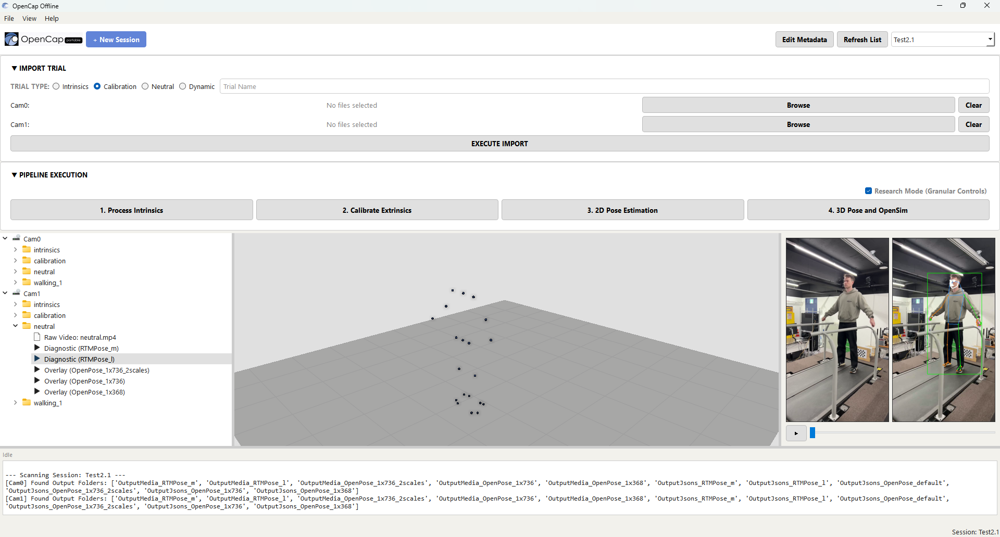

# Summary

OpenCap Offline is a desktop-bound graphical user interface (GUI) and software package that enables fully offline markerless biomechanical motion capture using smartphone-based video. Built upon the foundational code of the cloud-based OpenCap platform [@uhlrich2023opencap], this package is designed primarily to remove online dependencies, thereby improving data privacy and enabling fast, localised reprocessing. The software empowers researchers and clinicians to extract three-dimensional (3D) kinematics from synchronous, multi-camera video recordings captured by standard consumer devices. By containerising the entire processing workflow for local execution, OpenCap Offline ensures strict data privacy and eliminates the reliance on high-bandwidth internet connections and user traffic, making it uniquely suited for secure clinical environments and remote field research. A key contribution of this software is the ability to manually compute camera optical intrinsics, enabling the use of customised camera setups or devices not previously stored in the cloud-based OpenCap library.

The software architecture integrates state-of-the-art computer vision and biomechanical modelling tools into a unified, user-friendly pipeline. Through the GUI, users can import and manage session data, perform automated camera calibration (intrinsics and extrinsics via checkerboard detection), and execute two-dimensional (2D) human pose estimation using deep learning models such as OpenPose [@cao2019openpose] and RTMPose [@jiang2023rtmpose]. The extracted 2D keypoints are subsequently triangulated into 3D space and processed through OpenSim [@delp2007opensim] to generate scaled musculoskeletal models and joint kinematics. By abstracting the complex command-line executions typically associated with these underlying tools, OpenCap Offline provides an accessible, end-to-end solution for rigorous human movement analysis.

# Statement of need

Markerless motion capture has significantly lowered the barrier to entry for biomechanical analysis, allowing researchers to extract 3D kinematics using standard consumer cameras. Tools like OpenCap [@uhlrich2023opencap] have demonstrated that deep learning pipelines can achieve accuracy comparable to traditional marker-based systems. However, reliance on cloud computing infrastructure introduces some critical limitations. Researchers operating outside of a controlled laboratory environment, such as hospital clinics or sporting venues, often require immediate feedback from test results and the ability to reprocess data quickly and reliably when needed. Furthermore, remote or clinical settings are often bound by strict data privacy rules or ethical regulations, which may prohibit the transfer of test subject data to external or third-party servers for storage or processing. 
 
*OpenCap Offline* addresses these needs by providing a fully localised, offline graphical user interface (GUI) for markerless biomechanical processing. It distils the capabilities of the cloud-based OpenCap platform [@uhlrich2023opencap] into an offline package that can be installed and run locally on suitable hardware. The GUI wraps pose estimators (such as OpenPose [@cao2019openpose] and RTMPose [@jiang2023rtmpose]) and OpenSim's [@delp2007opensim] kinematic triangulation into a user-friendly, desktop-bound pipeline with the capacity to be iterated upon and improved with updates. By eliminating the need for cloud connectivity or command-line execution, this software empowers biomechanists, sports scientists, and clinicians to extract 3D kinematics securely on their own hardware, regardless of their environment or programming expertise.

# Acknowledgements

The author would like to acknowledge the developers of the original open-source tools on which the computational heavy-lifting of this software is based. Specifically, gratitude is extended to the original OpenCap team for their work and for sharing their open-source methodologies, the ongoing OpenSim project for providing a robust and versatile biomechanical modelling environment, and the developers of OpenPose and RTMPose (OpenMMLab) for their accessible computer vision frameworks. This project was conducted independently and received no specific external funding.

# References